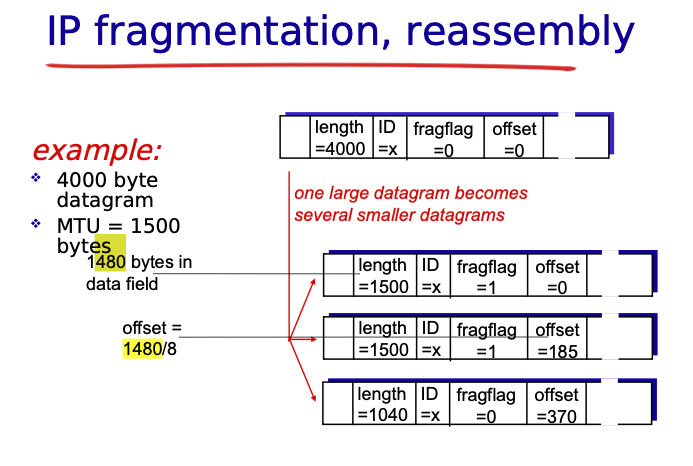

## Prompt: Ask me 10 more questions covering all topics, be as detailed as possible, throw many curveballs and make the question really hard. Imagine if you were training a student to take a test on this content. You only have 10 questions to prepare him for this test. Choose your questions carefully. 

1. Multiple Choice:
A 4000-byte IP datagram must traverse a link with an MTU of 1500 bytes. Assuming the IP header is 20 bytes and no options are used, which of the following correctly describes the fragmentation process?
A. The original datagram is split into three fragments, each carrying 1320 bytes of data, with the second fragment having a “More Fragments” flag of 0.
B. The first fragment carries 1480 bytes (20-byte header + 1460 bytes data), and the subsequent fragments have a data portion that is a multiple of 8 bytes, with the “More Fragments” flag set until the last fragment.
C. All fragments, including the first, are required to carry an identical header checksum, and the fragment offsets are measured in bytes.
D. The fragmentation is performed by every router along the path to ensure each fragment perfectly fits the MTU.

# B, The first fragment includes a 20-byte header with 1460 bytes of data (total 1480 bytes). The subsequent fragments carry data in multiples of 8 bytes, with the “More Fragments” flag set on all fragments except the last one. In this case, the fragmentation splits the packet into three fragments (1480 + 1480 + 1040 bytes).

2. Multiple Choice:
Which of the following is a key design improvement of IPv6 over IPv4 that directly enhances processing speed at each router?
A. Inclusion of an options field within the fixed header for better error handling.
B. Removal of the header checksum and use of a fixed-length header of 40 bytes.
C. Fragmentation at every router to better manage variable MTU sizes.
D. Introduction of a dynamic header length to support multiple upper-layer protocols.

# B, IPv6 enhances processing speed by using a fixed-length 40-byte header and by removing the header checksum. This simplifies and speeds up router processing compared to the variable-length IPv4 header (20–60 bytes).

3. True/False:
In a Software-Defined Networking (SDN) architecture using OpenFlow, routers (or switches) autonomously modify their flow tables based solely on local observations without any coordination from a centralized controller.
• True
• False
Explain your reasoning.

4. Short Answer:
Describe in detail the DHCP process from the initial broadcast by the client to the final acknowledgment by the server. In your answer, list the specific message types exchanged and mention at least three additional configuration parameters (other than the IP address) that the DHCP server can provide to the client.

5. Multiple Choice:
Consider a router using memory-based switching. Which of the following best explains the limitation of this switching technique?
A. It is restricted by the throughput of the shared bus connecting the ports.
B. It is limited by the processing power of the router’s CPU.
C. It is constrained by the memory bandwidth because every packet is copied to system memory.
D. It is primarily limited by the number of available flow table entries.

6. Short Answer:
Network Address Translation (NAT) is frequently criticized for undermining the end-to-end principle. Explain why NAT is controversial, and describe two challenges that NAT presents to application developers, especially in the context of peer-to-peer communications.

7. Choose All That Apply:
Which of the following fields in the IPv4 header are directly involved in the fragmentation and reassembly process?
☐ Time to Live (TTL)
☐ Identification
☐ Flags
☐ Fragment Offset
☐ Protocol
☐ Header Length

8. Multiple Choice:
Weighted Fair Queuing (WFQ) is often compared with Round Robin scheduling. Which statement best describes how WFQ differentiates itself from simple Round Robin scheduling in a router's output queuing?
A. WFQ strictly alternates between queues, regardless of packet size, ensuring equal service.
B. WFQ allocates service to each queue in proportion to a pre-assigned weight, allowing variable packet sizes to be accounted for.
C. WFQ only services the highest-priority queue until it is empty before moving to the next one.
D. WFQ discards packets from all queues randomly to avoid buffer overflow.

9. True/False:
Hierarchical addressing via CIDR allows ISPs to aggregate routes and reduce the size of global routing tables, but it can also constrain organizations from implementing highly granular routing policies for subnets within their allocated address block.
• True
• False
Explain your answer and any trade-offs involved.

10. Short Answer:
Define and contrast the control plane and the data plane in the context of router operation. How does the separation of these planes contribute to both the performance and scalability of modern networks? Provide examples from routing protocols or SDN architectures where applicable.

