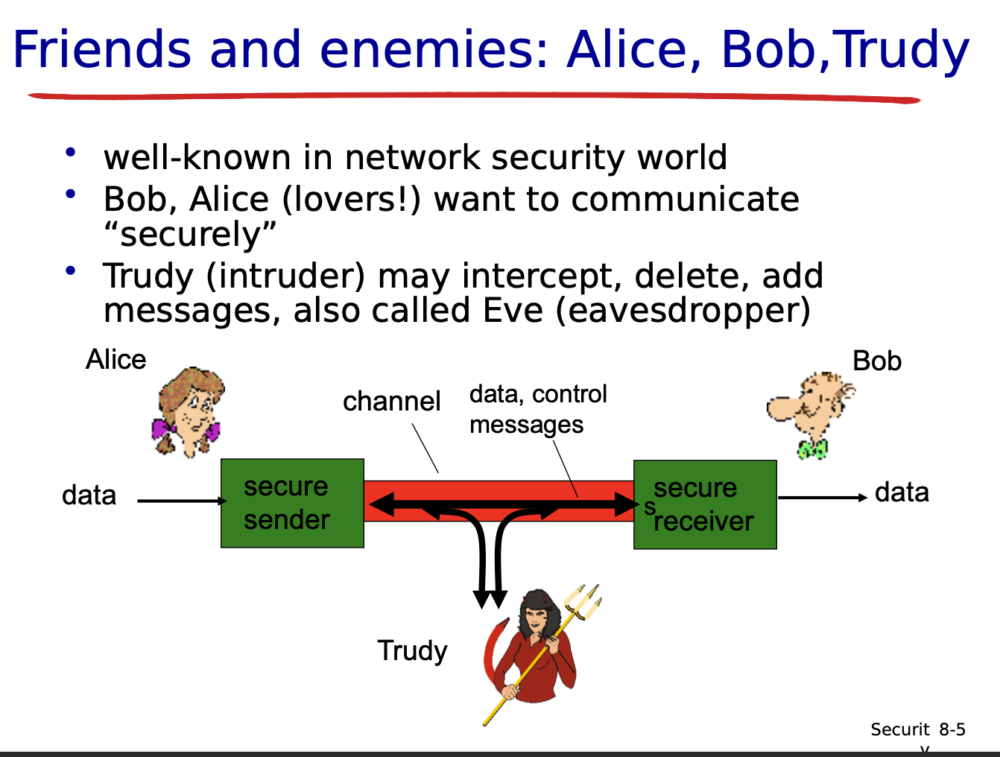
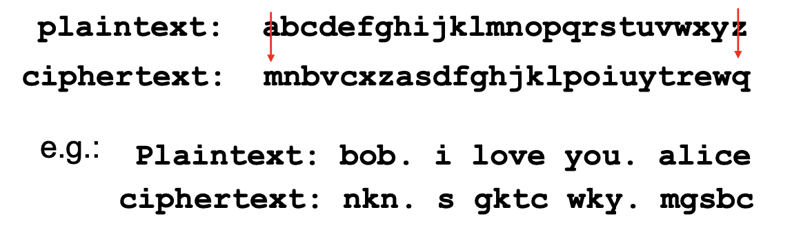
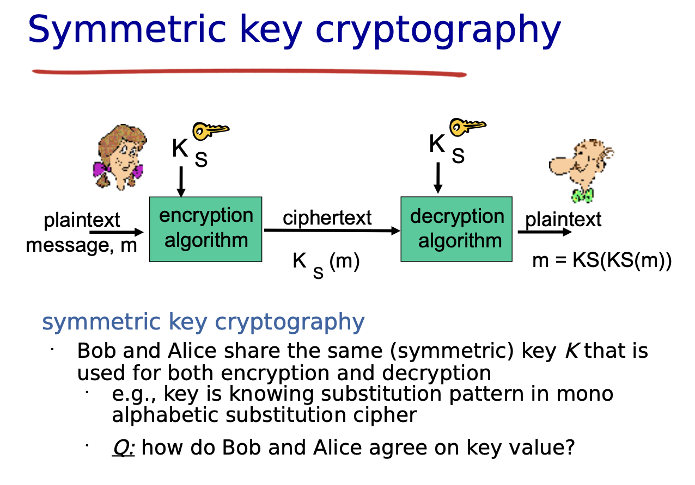
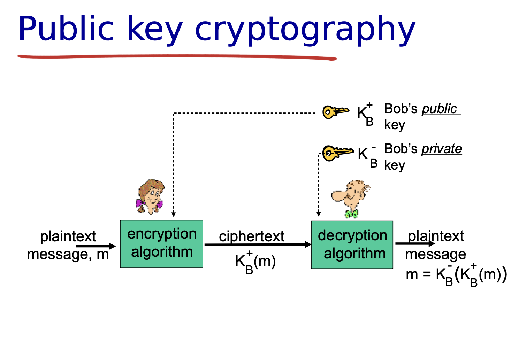
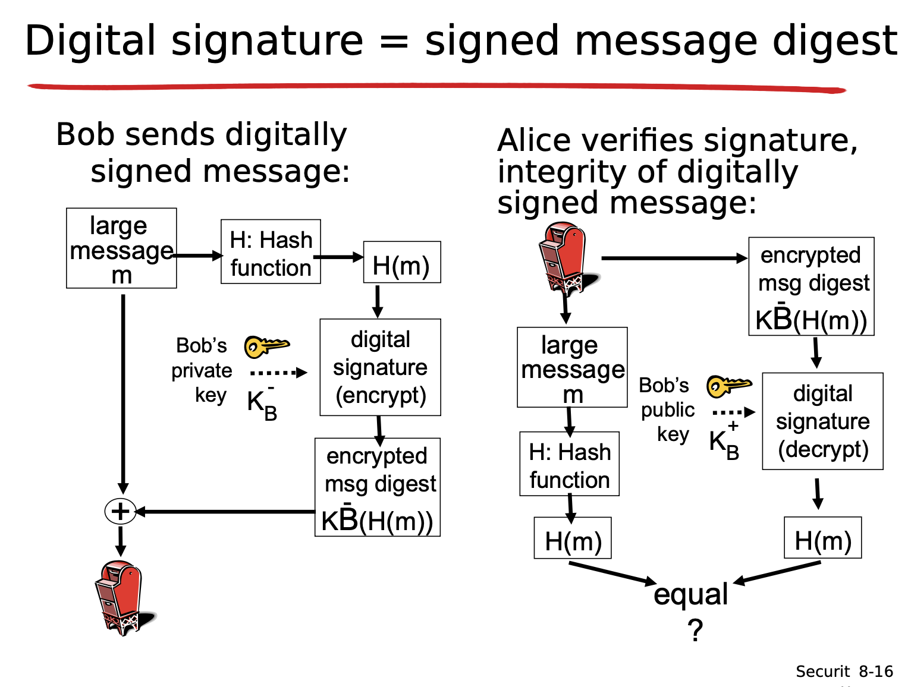

# **Chapter 8**

---

# What is the most secure computer in the world?
**A:** The one that is not connected to the internet, located in a secure room, and guarded by armed personnel.

---

# What is Network Security?
confidentiality: only intended persons should be able to read the
message: sender and receiver
– Encryption
● sender encrypts message
● receiver decrypts message
●
Authentication: sender, receiver want to confirm identity of each
other
●
Message integrity: sender, receiver want to ensure message not
altered (in transit, or afterwards) without detection
●
Access 

#### CIA triad – information security model
- **Confidentiality**: Information is only accessible to the intended person.
- **Integrity**: Information is correct and untampered with.
- **Availability**: Information is accessible when needed.
- These three principles are the cornerstone of security infrastructure and the tenets of cybersecurity.

#### AAA Model
- Methods to achieve cybersecurity objectives:
    - **Authentication**: Are you the person intended to view this information? Verifying identity.
    - **Authorization**: Are you authorized to read, write, and execute? Granting rights.
    - **Accountability**: Are you accountable for what happens to the computer system? Logging and tracking actions.

---

## Friends and Enemies: Alice, Bob, and Trudy

- **Alice (A)** and **Bob (B)** are communicating, while **Trudy (T)** is the intruder.
- What can a bad actor do?
    - **Eavesdrop**: Intercept communication (e.g., opening cars without the key).
    - **Insert Messages**: Inject messages into the connection.
    - **Impersonation**: Pretend to be someone else. can fake (spoof) source address in packet (or any field in packet)
    - **Hijacking**: Take over a session. Removing the sender and receiver and inserting himself in place
    - **Denial of Service (DoS)**: Disrupt service availability. By preventing service use by others.



---

# The Language of Cryptography

## Breaking An Encryption Scheme 
- Cipher-text (post-encrypted message) only attack, Trudy only has cipher text to analyze
	```
	M - plaintext message
	KA(m) - ciphertext, encrypted with key KA
	m = KB(KA(m))
	```


**1. Ciphertext-only attack**
- Trudy only has the encrypted message (ciphertext).
- She tries to break it with one of two methods:
	🔍 Brute force: Trying every possible key
	📊 Statistical analysis: Looking for patterns (like letter frequency)

**2. Known-plaintext attack**
- Trudy has both a piece of original message (plaintext) and its encrypted version.
- She uses this to figure out the key (e.g., by matching letters in a simple cipher).

**3. Chosen-plaintext attack**
- Trudy can choose a message and get its encrypted version.
- This gives her clues about how the encryption works and helps break it.

---

# Symmetric Key Cryptography
- Bob and Alice have share same key for both decryption and encryption

**Subsitution Cipher**
- substituting one thing for another
    - monoalphabetic cipher: substitute one letter for another


	- Encryption key: mapping from set of 26 letters
	to set of 26 letters

**DES: Data Encryption Standard**
- 56-bit key, now insecure (broken via brute-force) 64 bit plaintext input
- block cipher with block chaining
- Not very secure, 56-bit-key can be brute forced in less than 1 day
- 3DES more secure version, encrypt 3 times with 3 different keys (*chaining* 3 times)

**AES: Advanced Encryption Standard**
- Current standard, supports 128/192/256-bit keys
- process data in 128 bit blocks
- Brute force decryption taking 1 sec on DES would take 149 Trillon years on AES

`🔒 Highlights the evolution from DES → AES in response to increased computational power and security needs.`



m = K<sub>S<sub>(K<sub>S<sub>(m))


---

# Public Key Cryptography
- Symmetric Key Crypto
	- How does Any and Bob agree on a key if they never met in the first place?
- Public Key Crypto
	- Diffie-Hellman76, RSA78
	- sender/receiver do not share secret key
	- Everyone can know the public key, only receiver knows private key
	- Based on mathematical traps (e.g., factoring large primes in RSA)



---

# Digial Signatures
- Purpose: Non-repudiation, authenticity, integrity
- Uses hashing + private key encryption for signing
- Recipient uses sender's public key to verify



---

# Hashing
```
A digest is the "fingerprint" of a message.
It’s what you get after running something (like a password or a file) through a hash function.
```

Hash Functions: One-way, fixed-length digests

Algorithms mentioned:

MD5 (128-bit, deprecated due to vulnerabilities)
	- computes 128-bit messages, 4 step process
	- Turns any message into a 128-bit “fingerprint”
	- Hard to find a message that matches a specific MD5 hash
	- Was widely used, but now considered weak

SHA-1 (160-bit, also phased out for SHA-2/SHA-3 in modern systems)
	- Creates a 160-bit “fingerprint”
	- Official U.S. standard for a long time
	- More secure than MD5, but also outdated today

`Modern systems use SHA-256 and higher due to collision vulnerabilities in MD5/SHA-1.`